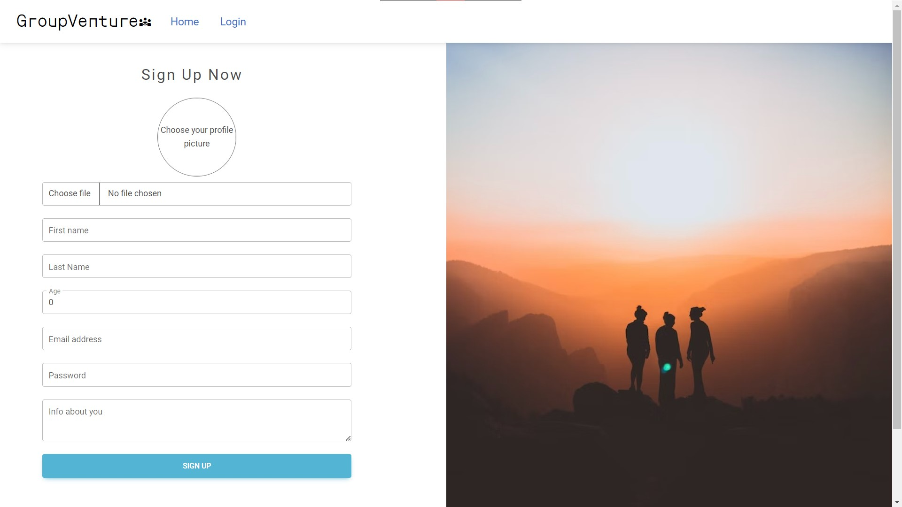

# GroupVenture
GroupVenture is Lorem ipsum dolor sit amet, consectetuer adipiscing elit. Aenean commodo ligula eget dolor. Aenean massa. Cum sociis natoque penatibus et magnis dis parturient montes, nascetur ridiculus mus. Donec quam felis, ultricies nec, pellentesque eu, pretium quis, sem. Nulla consequat massa quis enim.

## Getting started

Clone the repository:
```console 
git clone https://github.com/marce-msv/GroupVenture
 ```

Navigate to the client and server folders:
  ```console
  cd client // cd server
  ```

Install the required npm packages on each folder:
  ```console
  npm install
  ```

Set up the required environment variables or update and leave the default values for the PostgreSQL credentials and ports. <br>
You will also need a Google Maps Api Key and a Clodinary account to upload pictures.

Run the server in the back end and start the app in the front end
  ```console
  npm run server // npm start
  ```

## Comments and support
Feedback or suggestions are welcome. <br> Please get in touch via pull request or email.

## Screenshots
*Home page*

*Log In page*

*Sign Up page*

*Activity card*
